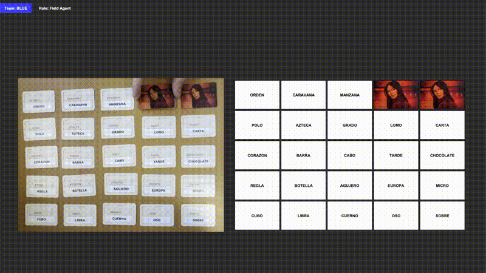

# Codenames Real-Time Board Game Detector CV Project



A real-time computer vision system that assists in playing Codenames board game by detecting and tracking card states using object detection and OCR. The system can identify revealed agent cards and maintain the game state while supporting both Spymaster and Field Agent roles.

## Technologies Used

- **Python** - Core programming language
- **OpenCV** - Image processing and video handling
- **PyTorch** - Deep learning framework for model development and training
- **YOLO (You Only Look Once)** - Real-time object detection for cards and key grid
- **EasyOCR** - Text recognition for codename cards
- **Tkinter** - GUI framework
- **PIL (Python Imaging Library)** - Image handling and processing
- **Ultralytics** - YOLO implementation
- **Threading** - Parallel processing for smooth video handling
- **Docker** - Containerization and deployment

## Project Development Process

### 1. Dataset Collection and Preparation

1. **Collect Images**
   - Record video samples of Codenames gameplay
   - Capture images of various key cards

2. **Labeling**
   - Use LabelImg to annotate images to train the models

   
    *Example of card annotation process using LabelImg*

### 2. Data Preprocessing

1. **Image Processing**
   - Resize images to consistent dimensions
   - Convert to appropriate format for YOLO training

2. **Dataset Organization**
   - Split into training/validation/test sets
   - Organize YOLO-compatible directory structure
   - Create data configuration files

### 3. Model Training

1. **YOLO Model Training**
   - Configure YOLO model parameters
   - Train card detection model
   - Train separate key grid detection model
   - Validate models' performance
   - Fine-tune for optimal accuracy

2. **OCR Integration**
   - Implement EasyOCR for text detection

### 4. Program Implementation

- GUI Development
- Game Logic

## Docker Setup

### Prerequisites
- Docker installed on your system
- Git repository cloned locally

### Building and Running

1. Build the Docker image:
```bash
docker build -t codenames-cv .
```

2. Run the container:
```bash
docker run --device=/dev/video0:/dev/video0 -e DISPLAY=$DISPLAY -v /tmp/.X11-unix:/tmp/.X11-unix codenames-cv
```

Note: The `--device` flag is needed for camera access, and the display-related parameters are required for GUI functionality.

## Third-Party Tools and References

- [LabelImg](https://github.com/tzutalin/labelImg) - Tool used for annotating images and creating training datasets
- [EasyOCR](https://github.com/JaidedAI/EasyOCR) - Optical Character Recognition library used for reading codenames from cards